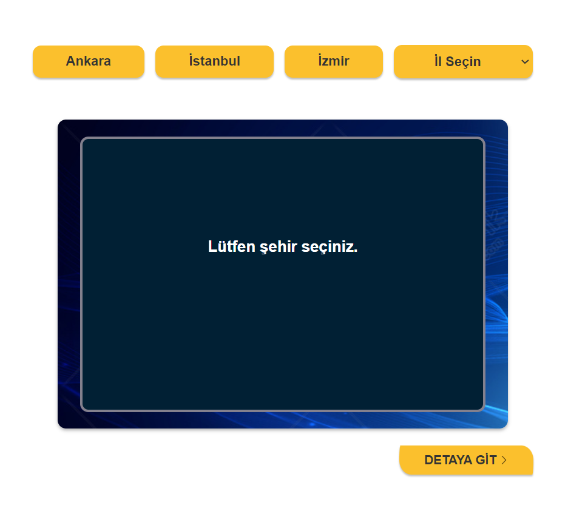
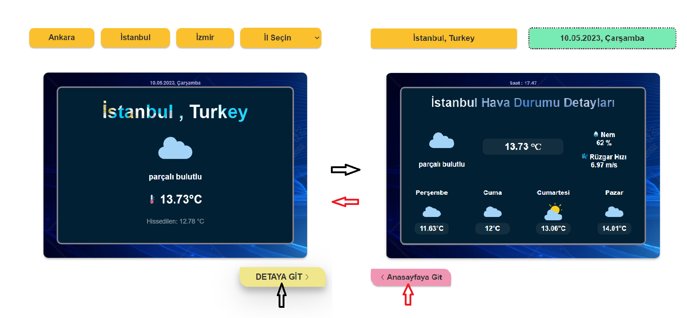

# Weather-App-AngularJs
Bu proje, OpenWeatherMap API'sini kullanarak hava durumu verilerini gösterir. HTML CSS ANGULARJS kullanılarak yapılmıştır.

# Başlarken 
Bu projeyi çalıştırmak için, OpenWeatherMap API'sinden bir API anahtarı almanız gerekiyor. Aşağıdaki adımları izleyerek API anahtarınızı projeye ekleyebilirsiniz:
- 1.OpenWeatherMap web sitesine gidin: https://home.openweathermap.org/users/sign_up
- 2.Kaydolma işlemini tamamlayın.
- 3.E-posta adresinizi onaylayın.
- 4.OpenWeatherMap API anahtarınızı oluşturmak için API bölümüne gidin: https://home.openweathermap.org/api_keys
- 5."Generate API key" düğmesine tıklayın.
- 6.API anahtarınızı kopyalayın.
- 7.Projenin ana dizininde config.js adında bir dosya oluşturun.
- 8.config.js dosyasına aşağıdaki kodu ekleyin ve API anahtarınızı yerine geçirin:
 >const api = '41a1f6.....';
- 9.Uygulamayı başlatın.

# ScreenShots

