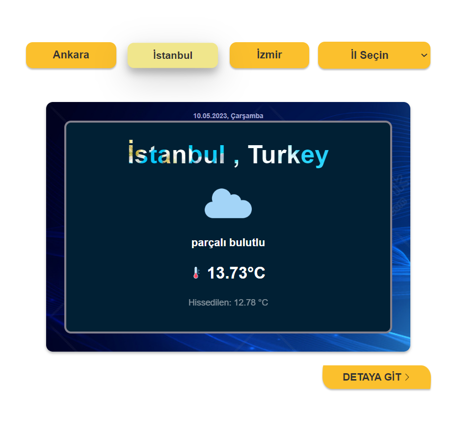

# Weather-App-AngularJs 
###### Hava-Durumu-Uygulaması-AngularJs
This project displays weather data using the OpenWeatherMap API. It is built using HTML, CSS, and ANGULARJS.   
  
Bu proje, OpenWeatherMap API'sini kullanarak hava durumu verilerini gösterir. HTML CSS ANGULARJS kullanılarak yapılmıştır.

### Get Started (Başlarken) 
To run this project, you will need to obtain an API key from OpenWeatherMap API. You can follow the steps below to add your API key to the project:  

Bu projeyi çalıştırmak için, OpenWeatherMap API'sinden bir API anahtarı almanız gerekiyor. Aşağıdaki adımları izleyerek API anahtarınızı projeye ekleyebilirsiniz:  

**_English_**

- 1.Go to the OpenWeatherMap website: https://home.openweathermap.org/users/sign_up
- 2.Complete the registration process.
- 3.Confirm your email address.
- 4.Go to the API section to generate your OpenWeatherMap API key: -5.https://home.openweathermap.org/api_keys
- 5.Click the "Generate API key" button.
- 6.Copy your API key.
- 7.Create a file named config.js in the project's root directory.
- 8.Add the following code to the config.js file and replace your API key:
>const api = '41a1f6.....';
- 9.Start the application.

**_Turkish_**
- 1.OpenWeatherMap web sitesine gidin: https://home.openweathermap.org/users/sign_up
- 2.Kaydolma işlemini tamamlayın.
- 3.E-posta adresinizi onaylayın.
- 4.API bölümüne giderek OpenWeatherMap API anahtarınızı oluşturun: https://home.openweathermap.org/api_keys
- 5."Generate API key" düğmesine tıklayın.
- 6.API anahtarınızı kopyalayın.
- 7.Projenin ana dizininde config.js adında bir dosya oluşturun.
- 8.Aşağıdaki kodu config.js dosyasına ekleyin ve API anahtarınızı yerine geçirin:
>const api = '41a1f6.....';
- 9.Uygulamayı başlatın.

# ScreenShots
-Herhangi bir şehir seçiniz.    
- Örneğin İstanbul seçelim. İstanbul hava durumu bilgileri verildi.    
- Detaya git butonuna basın. Geri dönmek için Anasayfaya Git butonuna basın.    
